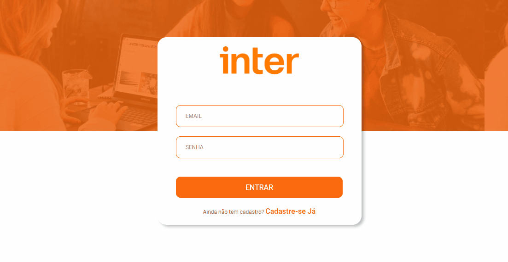
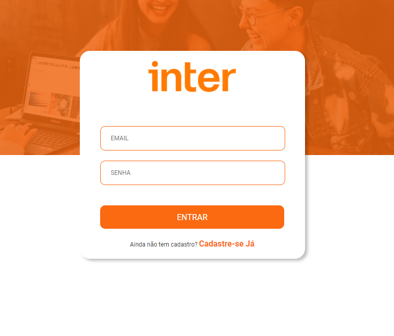
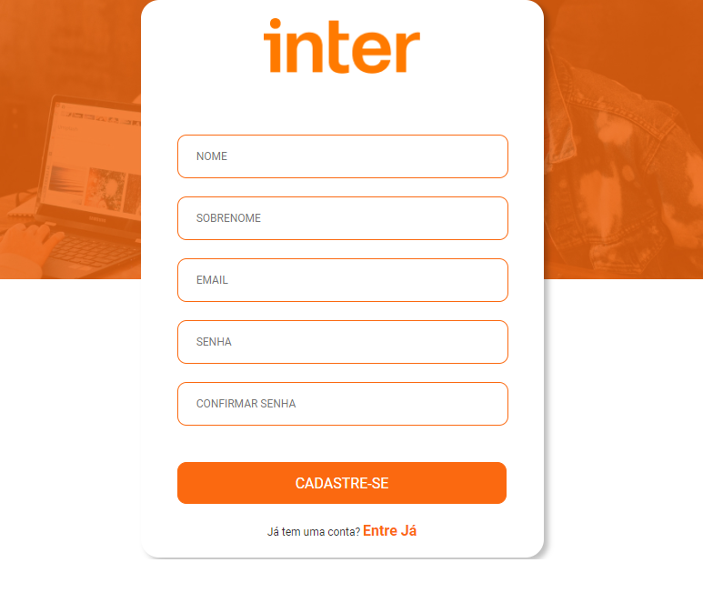

<h1 align="center">
   Sistema de transações bancárias realizadas através de chave PIX. 
</h1>

<p align="center" style="display: flex; align-items: flex-start; justify-content: center;">
  
</p>

<p align="center" style="display: flex; align-items: flex-start; justify-content: center;">
  
  
</p>


# 💻 Sobre

Este projeto foi realizado através do bootcamp apresentado pelo banco Inter juntamente com a plataforma Digital Innovation One. 
A aplicação é dividida em duas partes, sendo a a parte frontend que mostra toda a parte visual do sistema, sendo realizada com ReactJS e a parte backend expõe o que tem por trás da aplicação, sendo elaborado com NodeJS.  
Dessa forma, o sistema permite basicamente realizar transações bancárias via chave pix gerada pela API. Assim, através do sistema é possível cadastrar usuários, realizar o login. 
Postgres é o banco de dados utilizado para esse projeto. E toda a interface visual foi desenvolvida em React e Styled-Components abordando boas práticas de programação.

# 💡 Execução do projeto

```bash
  # Clonar este repositório 
  $ git clone https://github.com/diegohts/dio-banco-inter.git
  
  # Acessar ambas as pastas deste sistema (backend-inter e frontend-inter) 
  $ cd backend-inter
  $ cd frontend-inter
  
  # Após o acesso em cada pasta instalar suas dependências
  $ npm install ou yarn install
  
  # Para subir a base de dados do backend-inter para o seu docker
  $ docker-compose up 
  
  # Para executar a aplicação backend-inter
  $ npm run start:dev ou yarn start:dev
  
  # Para executar a aplicação frontend-inter
  $ npm start ou yarn start
  
```

## 🛠 Ferramentas 

As seguintes tecnologias foram utilizadas na construção do projeto:

- [Crypto-JS][cryptojs]
- [Docker][docker]  
- [Express][express]
- [JsonWebToken][jsonwebtoken]
- [Node.js][nodejs]
- [Nodemon][nodemon]]
- [React.js][react]
- [Styled-Components][styled]
- [TypeOrm][typeorm]
- [TypeScript][typescript]
- [Vscode][vscode]

[cryptojs]: https://www.npmjs.com/package/crypto-js
[docker]: https://docs.docker.com/
[express]: https://expressjs.com/pt-br/
[jsonwebtoken]: https://www.npmjs.com/package/jsonwebtoken
[nodejs]: https://nodejs.org/
[nodemon]: https://www.npmjs.com/package/nodemon
[react]: https://pt-br.reactjs.org/
[styled]: https://styled-components.com/
[typeorm]: https://typeorm.io/#/
[typescript]: https://www.typescriptlang.org/
[vscode]: https://code.visualstudio.com/

Made with 💜 by Diego Henrique 👋 [See my Linkedin](https://www.linkedin.com/in/diegohts/)

